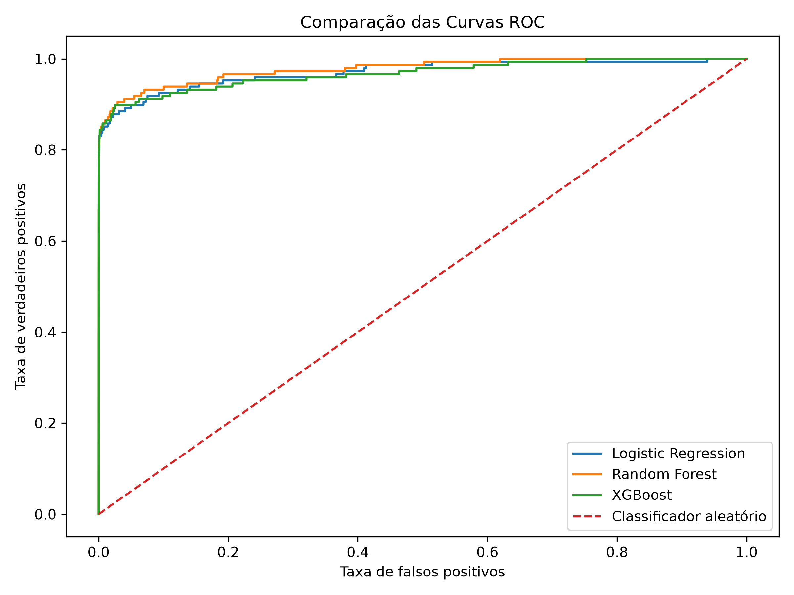
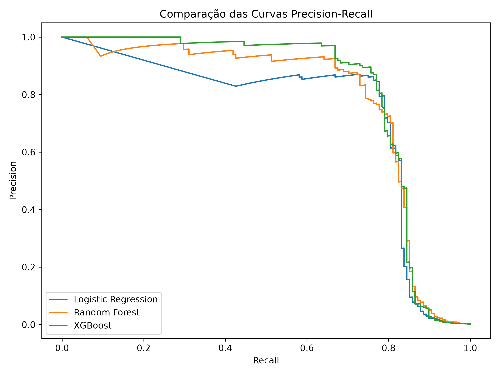

# 🛡️ Credit Card Fraud Detection using Machine Learning

> Projeto desenvolvido para identificar transações fraudulentas utilizando técnicas de Machine Learning e análise exploratória de dados.


---

# 📖 Sobre o projeto

A fraude em cartões de crédito representa um dos maiores desafios do setor financeiro.

Mesmo que a quantidade de fraudes seja muito pequena quando comparada ao volume total de transações, o impacto financeiro é extremamente elevado.

Este projeto apresenta uma solução completa utilizando Machine Learning para identificar transações fraudulentas, comparando diferentes algoritmos e avaliando seu desempenho através de métricas adequadas para problemas de classificação desbalanceada.

---

# 🎯 Objetivos

- Desenvolver um pipeline completo de Machine Learning.
- Realizar análise exploratória dos dados (EDA).
- Aplicar Feature Engineering.
- Comparar diferentes algoritmos de classificação.
- Avaliar os modelos utilizando métricas apropriadas.
- Documentar todo o processo de desenvolvimento.

---

# 📂 Estrutura do Projeto

```text
credit-card-fraud-detection/

├── assets/
├── data/
├── models/
├── notebooks/
├── reports/
├── src/
├── tests/
├── README.md
├── requirements.txt
└── main.py
```

---

# 🧰 Tecnologias utilizadas

- Python
- Pandas
- NumPy
- Matplotlib
- Seaborn
- Scikit-Learn
- XGBoost
- Joblib

---

# 📊 Dataset

O conjunto de dados utilizado é público e contém aproximadamente **285 mil transações financeiras**, sendo apenas uma pequena parcela classificada como fraude.

Esse forte desbalanceamento torna o problema particularmente desafiador e exige métricas mais robustas do que apenas a acurácia.

---

# 🔎 Etapas do Projeto

## 1. Análise Exploratória (EDA)

Foram realizadas análises para:

- distribuição das classes;
- identificação de valores nulos;
- detecção de duplicatas;
- análise estatística;
- histogramas;
- boxplots;
- heatmap de correlação.

---

## 2. Engenharia de Atributos

As principais transformações realizadas foram:

- criação da variável `Hour`;
- transformação logarítmica da variável `Amount`;
- preparação dos dados para modelagem.

---

## 3. Modelagem

Os seguintes modelos foram treinados:

- Logistic Regression
- Random Forest
- XGBoost

---

## 4. Avaliação

Os modelos foram avaliados utilizando:

- Accuracy
- Precision
- Recall
- F1-score
- ROC-AUC
- PR-AUC

Além disso, foi realizado o ajuste de diferentes thresholds para analisar o impacto entre precisão e recall.

---

# 📈 Resultados

Durante os experimentos, o modelo **Random Forest** apresentou o melhor equilíbrio entre Precision, Recall e F1-score no threshold padrão de 0,5.

O modelo **XGBoost** apresentou o melhor desempenho na métrica PR-AUC, demonstrando excelente capacidade para problemas altamente desbalanceados.

---

# 📷 Exemplos de Resultados

## Comparação entre modelos

> Adicione aqui a imagem:
## Comparação entre modelos


---

## Curva ROC



---

## Curva Precision-Recall



# 🚀 Como executar

Clone o repositório:

```bash
git clone https://github.com/Lucas-Endreus/credit-card-fraud-detection.git
```

Entre na pasta:

```bash
cd credit-card-fraud-detection
```

Crie o ambiente virtual:

```bash
python -m venv .venv
```

Ative o ambiente:

Windows

```bash
.venv\Scripts\activate
```

Instale as dependências:

```bash
pip install -r requirements.txt
```

Execute:

```bash
python main.py
```

---

# 📊 Pipeline

O pipeline desenvolvido realiza automaticamente:

- carregamento do dataset;
- preparação dos dados;
- treinamento dos modelos;
- avaliação;
- comparação de métricas;
- geração dos gráficos;
- salvamento dos resultados.

---

# 📌 Principais Aprendizados

Durante o desenvolvimento deste projeto foi possível aprofundar conhecimentos em:

- Ciência de Dados;
- Machine Learning;
- Feature Engineering;
- Avaliação de Modelos;
- Organização de projetos em Python;
- Estruturação de pipelines reutilizáveis.

---

# 🔮 Melhorias Futuras

- Deploy utilizando FastAPI.
- Interface Web com Streamlit.
- Otimização automática de hiperparâmetros.
- Integração com banco de dados.
- Monitoramento do desempenho do modelo.

---

# 👨‍💻 Autor

**Lucas Frota**

Projeto desenvolvido como parte da formação em Inteligência Artificial e Ciência de Dados da DIO.

---

# 📄 Licença

Este projeto está licenciado sob a licença MIT.
